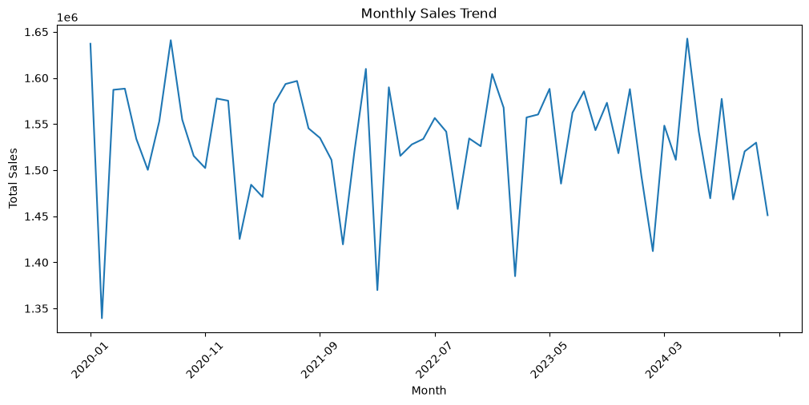
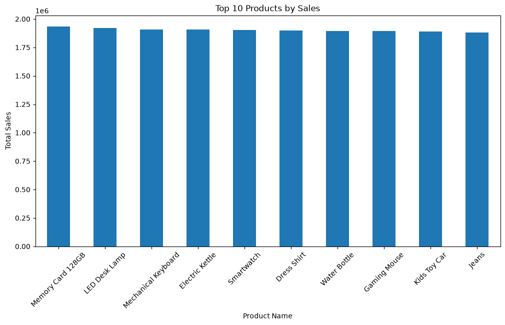
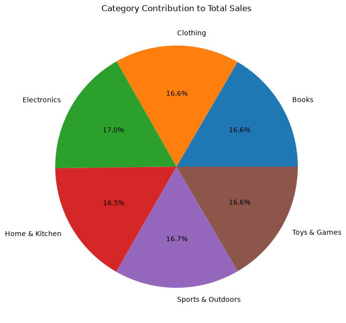
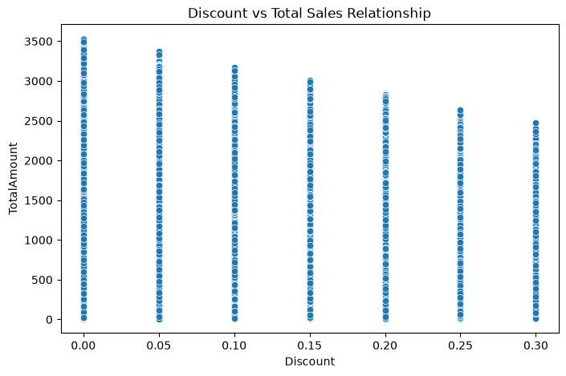

# 🛒 *Amazon Sales Analytics Dashboard*

## Problem Statement

E-commerce companies generate large amounts of sales data daily. However, raw data does not provide clear business insights.

This project aims to analyze Amazon sales data to identify:

- Sales trends over time
- Top-performing products
- Category-wise contribution
- Impact of discounts on sales

---

## Project Overview

This project analyzes Amazon sales data using Python to uncover meaningful business insights such as sales trends, product performance, category contribution, and discount impact.

The goal is to simulate a real-world e-commerce analytics project and convert raw data into actionable insights for business decision-making.

---

## Tools & Technologies

- Python
- Pandas
- NumPy
- Matplotlib
- Seaborn
- Jupyter Notebook
- Git & GitHub

---

## Key Business Questions Answered

- What are the top-selling products?
- Which category generates the highest revenue?
- How do monthly sales trends look?
- Does discount impact total sales?
- Which products contribute most to revenue?

---

## Visualizations

### Monthly Sales Trend

---

### Top 10 Products by Sales

---

### Category Contribution

---

### Discount vs Sales Relationship

---

## Power BI Dashboard

Power BI dashboard is currently in development.

The `.pbix` file structure has been added and will be updated with full visuals including:

- Sales Overview
- Category Performance
- Top Products
- Monthly Trends
- Profit Analysis

## Key Insights

- Electronics is the highest revenue-generating category.
- Sales are distributed across multiple categories with balanced contribution.
- Monthly sales show fluctuations but no extreme downward trend.
- A small number of products generate a large portion of revenue (Pareto principle).
- Discounts do not always guarantee higher sales.

---

## Skills Demonstrated

- Data Cleaning & Preprocessing
- Exploratory Data Analysis (EDA)
- Data Visualization
- Business Insight Generation
- Python Programming
- Git & GitHub Project Deployment

---

## Author

**Bhavana Kumari S**
Aspiring Data Analyst | Data Science Enthusiast

---

## Project Goal

To build a real-world data analytics project that demonstrates end-to-end workflow from raw data to business insights and visualization.

---
